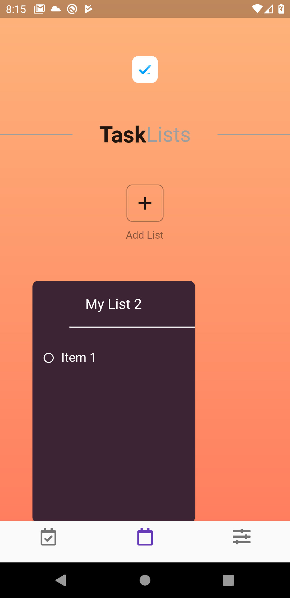

<h1 align="center">Flutter TODO</h1>

<h2 align="center">
 TODO is a Todo List app for Task Management inspired by the design below
</h2>

<h2 align="center">
 The Flutter Todo uses Firebase, you have to configure it from your side to test the app.
</h2>

Get the full code here: https://codecanyon.net/item/flutter-todo-task/26039669

  
  
  
  

<h2 align="center">
  <strong>UI Inspiration</strong>
</h2>

  

<h2 align="center">
  <strong>The Flutter TODO</strong>
</h2>

<a href="flutter_todo.apk">Try the APK</a>

1. Create TODO
2. Add Items
3. Authentication by Firebase
4. Database by Firebase Firestore
5. Reminder notifications
6. Custom Color selection for each card/list

  

  
  
  
  
  

# Firebase Cloud Firestore Backend

# How to contribute
To contribute to this project make the following guide:
- Fork this repository, It will create a copy of the repository into  your account.
- Clone the forked repository. (`git clone https://github.com/my-user/video-fall-detection.git`)
- Create your awesome code!
- Commit and push the changes.
- Create a pull request via Github. (Go to the forked repo and press the `Pull request` button)

Feel free to contribute ;)
